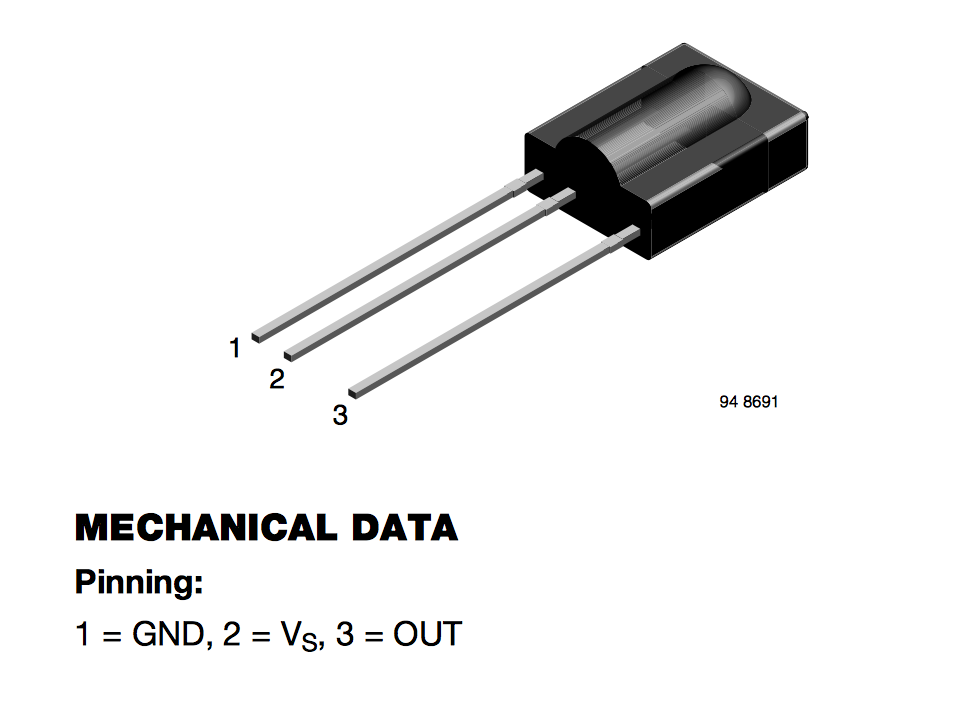

Wire up your Arduino as shown in the image below:

Use alligator clips to connect the motors, one end clipped to a motor lead, and the other end clipped to a jumper wire. Make sure you connect the correct wires for your chosen IR receiver. Search Google for your receiver's part number, and you should find a PDF "data sheet" with an image like this one:

In this sheet, pin `VS` should be connected to 5V, pin `GND` to ground, and `OUT` to Arduino digital pin 2.